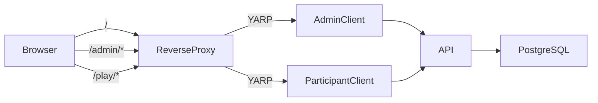

# Architektur

## Solution-Projekte

| Projekt | Verantwortung |
| --- | --- |
| `WeihnachtsfeierBit.ApiService` | HTTP-API, Login, Admin-Sharing & Rechte, SignalR Hubs (`GameStateHub`, `CanvasHub`) und automatische EF-Core-Migrationen beim Start |
| `WeihnachtsfeierBit.AdminClient` | Server-seitiger Blazor-Client mit Admin-Login, Projektverwaltung, gekürzter Icon-Workspace-Sidebar, globaler Show-Bibliothek und Live-Session-Steuerung |
| `WeihnachtsfeierBit.ParticipantClient` | Server-seitiger Blazor-Client für Teilnehmer unter `/play/{projectId}` und Beameransicht unter `/play/beamer/{sessionCode}`, mit SignalR Live-Anbindung und Verbindungs-Latenzanzeige |
| `WeihnachtsfeierBit.Framework` | Rollenübergreifender Razor-Class-Library-Baustein mit generischen UI-Primitiven, API-Client, `FrameworkConnectionStatus` und gemeinsam genutzten Verträgen |
| `WeihnachtsfeierBit.Web` | Reverse-Proxy; proxyt `/admin` per YARP an den AdminClient und `/play` an den ParticipantClient |
| `WeihnachtsfeierBit.Data` | EF-Core-Entities, PostgreSQL-Mappings und Migrationen |
| `WeihnachtsfeierBit.ServiceDefaults` | Aspire Service Discovery, Health Checks, Resilience und Telemetrie |
| `WeihnachtsfeierBit.AppHost` | Lokale Aspire-Orchestrierung |

```mermaid
flowchart LR
    Browser -->|/| ReverseProxy
    Browser -->|/admin/*| ReverseProxy
    Browser -->|/play/*| ReverseProxy
    ReverseProxy -->|YARP| AdminClient
    ReverseProxy -->|YARP| ParticipantClient
    AdminClient --> API
    ParticipantClient --> API
    API --> PostgreSQL
```

## Laufzeit

`WeihnachtsfeierBIT/docker-compose.yml` startet PostgreSQL, API, Reverse-Proxy, AdminClient und ParticipantClient als Container. Am Host veröffentlicht sind Proxy `8080`, API `8081` und PostgreSQL auf `127.0.0.1:5432`. Der Adminclient-Port bleibt intern; `/admin` wird vom Proxy weitergeleitet. Aspire beschreibt denselben Dienstgraphen für lokale Entwicklung.

## SignalR Hub-Sharing Architektur

Zur Schonung von Serverressourcen und Vermeidung redundanter WebSocket-Verbindungen unterstützt das Chat-System (`FrameworkChat`) **Hub-Connection-Sharing**:
- Wenn ein Elternkontext (z. B. das Session-Dashboard oder der Teilnehmer-Client) bereits eine aktive `HubConnection` zu `/hubs/gamestate` unterhält, wird diese Verbindung an den Chat übergeben.
- Der Chat registriert seine Event-Listener (`ReceiveChatMessage`, `ReceiveMessageDeleted`, `ReceiveGroupDeleted`, `ReceiveGroupRenamed`) direkt auf der bestehenden Verbindung, anstatt einen zweiten WebSocket zu öffnen.
- Bei Betrieb als Standalone-Chat-Seite (ohne Elternkonnektor) baut die Komponente eigenständig eine Verbindung auf.
- Chat-Events werden über eine separate SignalR-Projektgruppe ausgeliefert. Teilnehmer gelangen nur mit effektivem Leserecht in diese Gruppe; Änderungen globaler oder individueller Rechte aktualisieren offene Verbindungen und leeren bei Entzug die Chatansicht.

## End-to-End Diagnose-System

Für schnelles Debugging und Fehlerberichte steht ein In-Memory-Diagnosesystem zur Verfügung:
- **`ClientDiagnosticLogger`**: Ein speicherbegrenzter Ringpuffer (max. 200 Einträge) in `WeihnachtsfeierBit.Framework`, der API-Anfragen, HTTP-Statuscodes (`401`, `500`), SignalR-Zustände und Exceptions aufzeichnet.
- **`DiagnosticModal`**: Ein interaktives UI-Modal, das über die Regie-Toolbar (`[ 🛠️ Diagnose ]`) aufgerufen werden kann und einen Live-Protokollfilter sowie eine Ein-Klick-Zwischenablagekopie (*„Protokoll kopieren“*) bereitstellt.
- **Server-Diagnose**: `ProjectAccessService` protokolliert detaillierte Auth-Warnungen in der Serverkonsole, falls Authentifizierungen fehlschlagen.

## Codepfade

- API-Komposition & SignalR Hubs: `WeihnachtsfeierBit.ApiService/Program.cs` (`GameStateHub` unter `/hubs/gamestate`, `CanvasHub` unter `/hubs/canvas`), Hintergrund-Worker `ScheduledEventsBackgroundService.cs` für automatische Event-Starts.
- Endpunkte: `WeihnachtsfeierBit.ApiService/Endpoints/`
- Admin Sharing & Permissions: `WeihnachtsfeierBit.ApiService/Endpoints/AdminSharingEndpoints.cs`
- Authentifizierung und Projektfilter: `WeihnachtsfeierBit.ApiService/Auth/`
- Admin-Routen, Fachansichten, Icon-Sidebar und Adminformulare: `WeihnachtsfeierBit.AdminClient/`
- Teilnehmer-Client (`/play/{projectId}`): `WeihnachtsfeierBit.ParticipantClient/`
- Generische UI-Primitiven und gemeinsame API-Adapter: `WeihnachtsfeierBit.Framework/`

Fachlogik gehört in Endpoint-/Serviceklassen. SignalR-Verbindungen werden bei Abbruch automatisch mit wachsendem Retry-Abstand wieder aufgebaut; nach Wiederverbindung synchronisieren sie ihren Gruppenbeitritt und den aktuellen Serverzustand.
